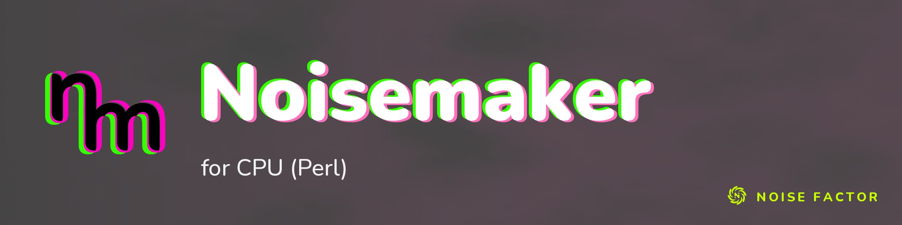

<!-- repo-hero -->

Open source from <a href="https://noisefactor.io">Noise Factor</a> &middot; <a href="https://github.com/noisefactorllc">more projects</a>

# noisemaker-for-perl

> This package supports the "Export Shader Pipeline" feature in Noisedeck.app. The feature runs shader compositions on other platforms. Noise Factor derives this package from the upstream Noisemaker Engine project and tests it for pixel-level parity.

**Math::Fractal::Noisemaker v1.000** — a software runtime for shaders, in pure Perl.

This is the Perl home of the [Noisemaker](https://noisemaker.app) rendering engine. It renders the 205-effect shader catalog behind [Noisedeck](https://noisedeck.app) entirely on the CPU, with byte-parity against the reference engine.
GLSL comes from the Noisemaker shader CDN. A pure-Perl GLSL ES 3.00 front end transpiles it to Perl. A float32-faithful runtime executes it per pixel and reproduces GPU arithmetic:

- Float32 register rounding.
- Half-float render-target quantization.
- GLSL uint32 wraparound.
- Screen-space derivatives.
- GL texture sampling.

The classic `Math::Fractal::Noisemaker` made noise in a loop. It still makes
noise — it just learned every other trick in the deck too.

## Install

Core modules only — no CPAN dependencies.

    perl Makefile.PL
    make
    make test
    make install

## Use

    make-noise generate synth/noise --width 512 --height 512 --seed 3
    make-noise generate random
    make-noise apply filter/crt art.png
    make-noise animate synth/curl --frame-count 50 --filename curl.mp4
    echo 'search synth, filter
    noise(seed: 3, ridges: true).vignette().write(o0)
    render(o0)' | make-noise run --width 512 --height 512

Or from Perl:

    use Math::Fractal::Noisemaker::Renderer qw(render_effect);
    use Math::Fractal::Noisemaker::PNG qw(encode_png);

    my $surface = render_effect('synth/noise', { seed => 3 },
        undef, width => 512, height => 512, seed => 3);
    open my $out, '>:raw', 'noise.png' or die $!;
    print {$out} encode_png($surface);

## Parity

`scripts/parity.pl` compares all 169 non-iterated image effects with the
reference JS engine (a sibling `noisemaker-for-cpu` checkout). It requires
exact RGBA8 bytes and fails on differences or errors. The 36 iterated and typed
effects are reported separately and covered by the DSL tests.

## Regenerating the bundle

    perl scripts/build-bundle.pl --all

This command fetches per-effect GLSL and metadata from the shader CDN and transpiles it into `lib/Math/Fractal/Noisemaker/bundle/`. The inputs are cached and sha256-locked in `bundle-lock.json`.

## License

MIT. Copyright (c) Noise Factor LLC.
